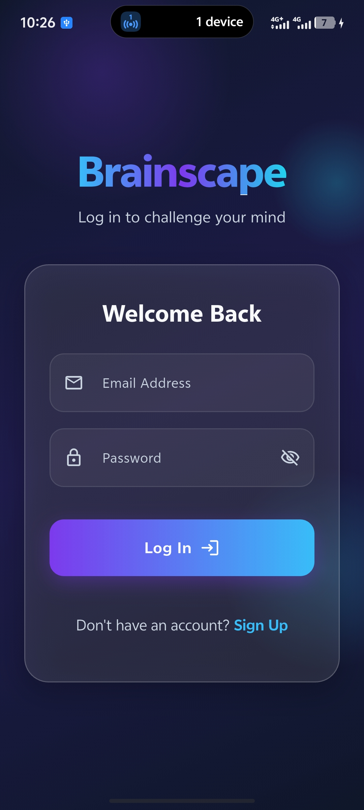

# Brainscape

A beautiful, responsive, and interactive Flutter quiz application designed to challenge your mind and track your learning progress.

---

## 🎨 Authentication Showcase

Below is a preview of the premium, glassmorphic sign-in interface built for Brainscape.



---

## 🔐 The Authentication Feature

The authentication module in Brainscape is implemented using a **Clean Architecture** approach coupled with **Riverpod** for state management and **Firebase Authentication** for user accounts. It provides a secure, interactive, and visually stunning onboarding experience.

### 🌟 Key UX & Design Highlights
- **Vibrant & Dynamic Aesthetics**: Features floating, animated color blobs in the background (`deepPurple`, `electricBlue`, and `cyan`) moving gracefully to capture user attention and feel alive.
- **Glassmorphism Design**: The forms are contained within custom semi-transparent `GlassCard` layouts, delivering a modern, high-end feel.
- **Seamless Form Toggle**: Switches smoothly between **Log In** and **Sign Up** forms using an `AnimatedSwitcher` containing matched `FadeTransition` and `SlideTransition`.
- **Robust Field Validation**: Interactive checks for email formatting and password strength, providing instant feedback before form submission.
- **Error Visualization**: Captures Firebase auth exceptions (e.g. invalid credentials, email already in use, network failure) and maps them to clean user-facing error messages shown in styled, floating SnackBars.

---

### 📂 Directory & Code Structure

The authentication system is organized into modular directories under `lib/features/auth`:

```text
lib/features/auth/
├── data/
│   └── auth_repository.dart       # Direct communication with Firebase SDK & error mapping.
├── providers/
│   └── auth_provider.dart         # Riverpod providers for auth state and action controllers.
└── presentation/
    ├── auth_gate.dart             # Reactive session gateway (switches between Home and Auth).
    ├── auth_screen.dart           # Parent layout orchestrating background blobs and card toggles.
    ├── login_form.dart            # Log In form with input validation and loading states.
    └── signup_form.dart           # Sign Up form with password-confirmation matching.
```

---

### ⚙️ Deep Dive: Architecture & State Management

#### 1. Repository Pattern (`auth_repository.dart`)
`AuthRepository` serves as the data layer interface. It wraps Firebase Authentication methods, ensuring that raw backend calls are isolated from the application's presentation layers.
*   **Session Stream**: Exposes `authStateChanges` which streams the current `User?` object whenever a user logs in or out.
*   **Error Normalization**: Maps Firebase auth codes (`invalid-email`, `email-already-in-use`, `wrong-password`, etc.) to helpful, human-readable strings.

#### 2. Riverpod State Providers (`auth_provider.dart`)
State management is handled reactively using Riverpod:
*   **`authStateChangesProvider`**: A `StreamProvider<User?>` that is watched by `AuthGate` to reactively render the appropriate screen based on session state.
*   **`authControllerProvider`**: A `StateNotifierProvider` managing `AsyncValue<void>`. It captures the asynchronous state (loading, error, success) when a user submits a form, preventing multiple simultaneous requests and indicating loading animations in buttons.

#### 3. Reactive Gateway (`auth_gate.dart`)
Acts as the entry point of the app route:
```dart
final authState = ref.watch(authStateChangesProvider);
return authState.when(
  data: (user) => user != null ? const HomeScreen() : const AuthScreen(),
  loading: () => const Scaffold(body: Center(child: CircularProgressIndicator())),
  error: (err, stack) => ErrorScreen(err),
);
```

---

## 🚀 Getting Started

### Prerequisites
- Flutter SDK (`^3.12.1` or later)
- Firebase Account configured with **Email & Password Authentication** enabled

### Run the App
1. Clone the repository and navigate to the project directory:
   ```bash
   flutter pub get
   ```
2. Run the application:
   ```bash
   flutter run
   ```
