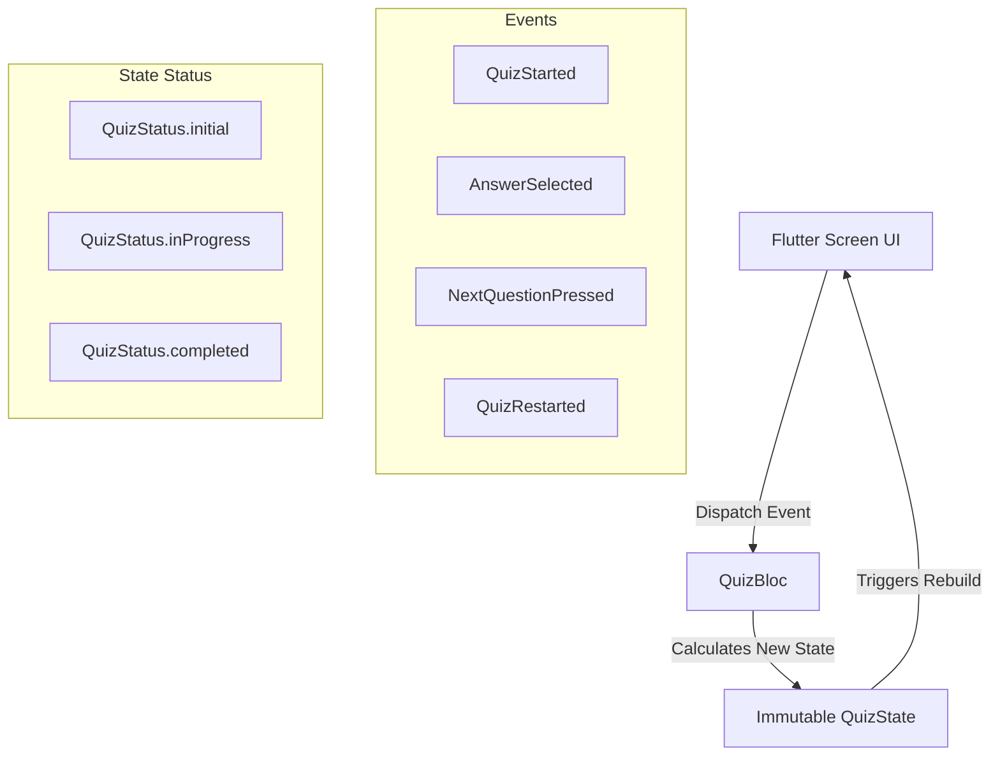

# 🧠 Brainscape — Premium Flutter Quiz Application

Brainscape is a highly polished, modern, and beautiful quiz application built using **Flutter** and **Dart**. Designed as a high-fidelity showcase of premium mobile design principles, the application demonstrates that stunning visual experiences can be crafted completely natively in Flutter without relying on heavy third-party UI or animation libraries.

The application features a comprehensive quiz testing core Computer Science fundamentals and Flutter framework concepts.

---

## ✨ Key Features

1. **Premium Dark Theme & Glassmorphism**:
   - Built around a dark backdrop using harmonized deep slate (`#0F172A`) and dark indigo (`#1E1B4B`) gradients.
   - Interactive components use translucent glassmorphic surfaces (`GlassCard`) with soft, high-fidelity shadows and subtle borders to create layers of depth.

2. **Dynamically Pulsating Background Blobs**:
   - The interface feels alive with multiple custom-animated background blobs (`AnimatedBlob`).
   - These semi-transparent colorful shapes float and translate slowly in the background using mathematical sine/cosine waves, generating a subtle, premium parallax effect.

3. **Staggered Question & Option Entrances**:
   - When a question screen loads, the question and its options do not jump into view. Instead, they slide up and fade in with a **staggered physics animation** (`Curves.easeOutBack`) to guide the user's focus.

4. **Interactive Option Cards**:
   - Selection scales cards up slightly (`AnimatedScale`) to give tactile feedback.
   - Upon submission, cards transition color dynamically (`AnimatedContainer`): correct answers glow with a emerald green hue (`#22C55E`), while incorrect answers fade into a soft red (`#EF4444`).
   - Trailing feedback icons (checkmark/crossmark) slide into view upon answer reveal.

5. **Circular Progress Indicator (Arc)**:
   - On the results screen, a custom-drawn radial score indicator (`ScoreCircle`) uses a custom `SweepGradient` to display progress.
   - Features a custom outer glow dot drawing at the tip of the score path to simulate energy, drawn entirely on a canvas.

6. **Canvas Confetti Simulation**:
   - Completing the quiz with a passing score launches a high-performance, lightweight 4-second confetti/celebration animation overlay.
   - Particles bounce, rotate, drift, and fade away using physics variables calculated per-particle and rendered at 60 FPS using Flutter's native `CustomPainter` and `Canvas` APIs.

---

## 🛠️ Technology Stack

The project adheres to a strict "no-heavy-external-package" constraint to demonstrate native Flutter capabilities. 

* **Language**: Dart (SDK version `^3.12.1` with modern null-safety, pattern matching, and records).
* **Framework**: Flutter SDK (Material 3 enabled, custom styled components).
* **State Management**: BLoC Pattern via the official `flutter_bloc` package. This separates business logic from user interfaces.
* **Architecture**: Clean Architecture principles (Presentation, Domain, Data, Core layers).
* **Animations**: Native Flutter Animation framework (`AnimationController`, `TweenAnimationBuilder`, `SlideTransition`, `FadeTransition`, `ScaleTransition`).
* **Graphics Rendering**: Low-level Canvas API (`CustomPaint`, `CustomPainter`) for mathematical rendering of particle engines and radial score progress indicators.
* **Routing**: Declarative named routes with custom-animated page transitions (`PageRouteBuilder` combining slide-up and fade-in effects).

---

## 🏗️ Project Structure

The project code is organized under a modular, maintainable, and clean directory structure:

```text
lib/
├── app/                           # Core Application Entry & Configuration
│   ├── app_routes.dart            # Named route generator & custom page transitions
│   ├── app_theme.dart             # Dark Material 3 theme definition
│   └── brainscape_app.dart        # Root widget providing BLoC and MaterialApp
│
├── core/                          # Cross-cutting concerns and shared helpers
│   ├── constants/
│   │   ├── app_colors.dart        # Harmonized premium palette constants
│   │   ├── app_dimensions.dart    # Padding, radius, and sizing constants
│   │   └── app_strings.dart       # User-facing localized strings
│   └── utils/
│       └── score_utils.dart       # Performance scoring tiers & icon calculators
│
├── features/                      # Feature-driven modules (Quiz feature)
│   └── quiz/
│       ├── data/
│       │   ├── quiz_data.dart             # Static list of 20 CS & Flutter questions
│       │   └── quiz_repository.dart       # Local question database repository
│       │
│       ├── domain/
│       │   └── models/
│       │       ├── quiz_question.dart     # Question structure representation
│       │       └── quiz_result.dart       # Result scoring record
│       │
│       ├── presentation/
│       │   ├── bloc/                      # Business Logic Component layer
│       │   │   ├── quiz_bloc.dart         # Handles quiz state transitions & guards
│       │   │   ├── quiz_event.dart        # User actions (Started, Selected, Next, Restart)
│       │   │   └── quiz_state.dart        # Immutable UI state & getters
│       │   │
│       │   ├── screens/                   # Top-level route pages
│       │   │   ├── welcome_screen.dart    # Entrance screen with hero graphics
│       │   │   ├── quiz_screen.dart       # Main quiz screen with animations
│       │   │   └── result_screen.dart     # Results page with statistics
│       │   │
│       │   └── widgets/                   # Modular reusable components
│       │       ├── animated_background.dart # Full-screen gradient backdrop
│       │       ├── animated_blob.dart       # Softly floating neon fluid blobs
│       │       ├── animated_progress_bar.dart # Smooth linear gradient progress bar
│       │       ├── celebration_painter.dart # Custom physics-based confetti engine
│       │       ├── glass_card.dart          # Premium glassmorphic container
│       │       ├── gradient_button.dart     # Pressable scaling gradient CTA button
│       │       ├── option_tile.dart         # Interactive stagger-animated options
│       │       ├── score_circle.dart        # Custom painted score circle progress
│       │       └── stat_card.dart           # Compact success stat counters
│
└── main.dart                      # App launcher (instantiates BrainscapeApp)
```

---

## 🎛️ BLoC Architecture & State Flow

The app lifecycle is driven entirely by a state machine managed via `QuizBloc`. The state transitions follow a strict unidirectional data flow:



### Key Safety Guards in `QuizBloc`:
* **Double-Scoring Prevention**: Once an option is selected, the bloc logs that question's index in a `_scoredQuestions` set. Subsequent selection attempts are ignored.
* **Answer Locking**: The state sets `hasAnswered = true` immediately, blocking further option triggers until the next question is loaded.
* **Index Bounds Check**: Transitioning questions checks the collection length to prevent out-of-range exceptions.

---

## 💻 How to Get Started

### Prerequisites
Make sure you have the Flutter SDK installed on your machine (`>= 3.12.1`).

### Installation
1. Clone this repository to your local computer.
2. Open your terminal in the project directory (`x:\brainscape`).
3. Fetch dependencies:
   ```bash
   flutter pub get
   ```

### Running the App
* Start the project on a connected simulator, emulator, or desktop build:
  ```bash
  flutter run
  ```

### Static Analysis
* Run static analysis to verify there are zero lint issues or compiler warnings:
  ```bash
  flutter analyze
  ```

---

## 💎 Design Tokens & Custom Widgets

* **`AppColors`**: Uses custom hex codes optimized for OLED dark displays. Purple (`#7C3AED`) and Cyan (`#22D3EE`) are utilized as energy indicators.
* **`AppDimensions`**: Standardized margins, padding increments, and card curvatures.
* **`GlassCard`**: Mixes a white translucent fill (`Color(0x1AFFFFFF)`) with blurred borders (`Color(0x33FFFFFF)`) to reproduce modern premium macOS/iOS glass finishes.
* **`CelebrationPainter`**: Instantiates a 50-particle engine simulating gravity, horizontal wind drift, and rotational angles calculated frame-by-frame on screen canvas, producing light animations without resource leaks.
